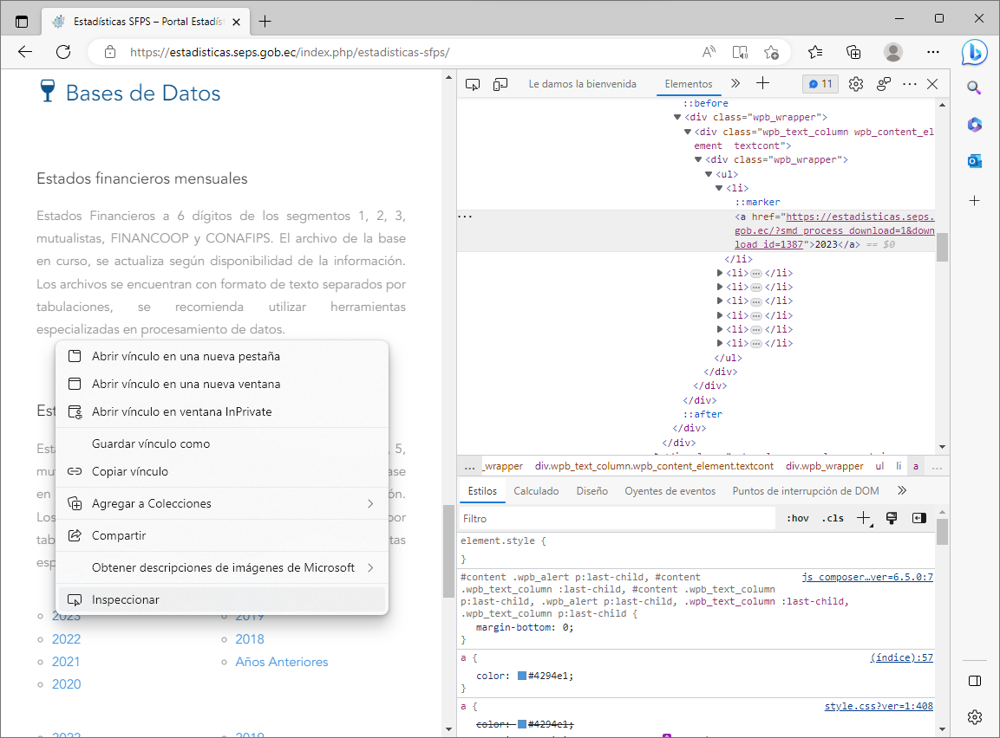

```{r setup, include=FALSE}
knitr::opts_chunk$set(echo = TRUE)
```

# Paquete rvest

El paquete Rvest es una herramienta para la extracción y manipulación de datos de páginas web en R. Permite la lectura de datos de una variedad de formatos web, incluyendo HTML, XML y JSON. Además, ofrece una variedad de herramientas de análisis y manipulación de datos web, incluyendo la extracción de texto, la exploración y manipulación de nodos HTML, el llenado de formularios y el seguimiento de enlaces. Rvest es una herramienta útil para analistas de datos que desean obtener información de sitios web y automatizar el proceso de recopilación de datos.

La presente documentación incluye la explicación detallada de la función: `analisisPaginaWebEnlaces()` alojada en la carpeta `scripts`.

```{r eval=FALSE}
# Instalar el paquete httr si no está instalado
if (!require("rvest")) {
  install.packages("rvest")
} else {
  "Paquete instalado previamente."
}
```

# Lectura de la página web

La librería `rvest`, permite la extracción de información de páginas web, establece una URL para la página web a analizar y utiliza la función `read_html` para cargar el contenido de la página web en un objeto llamado `page`.

```{r eval=FALSE}
library(rvest)

url <- "https://estadisticas.seps.gob.ec/index.php/estadisticas-sfps/"
page <- rvest::read_html(url)

"Lectura de la pagina completada."
```

# Análisis por nodos

## Contenedor con los enlaces de la Base de Datos

Un nodo `div` con la clase `vc_row wpb_row vc_row-fluid` es un elemento HTML que se utiliza para crear una sección en una página web. El elemento `div` es un contenedor genérico para contenido de flujo y no tiene un significado semántico específico. Se utiliza principalmente para aplicar estilos CSS al contenido que contiene. La identifiación del nodo personalizado `vc_custom_1623732905705`, es similar a lo expuesto en la siguiente sección.

```{r eval=FALSE}
contenedores_div <- 
  page %>% 
  html_nodes("div.vc_row.wpb_row.vc_row-fluid.vc_custom_1623732905705")
```

Las clases `vc_row`, `wpb_row` y `vc_row-fluid` son clases específicas de un tema o plugin de WordPress y se utilizan para dar formato y estilo a la sección creada por el elemento `div`. La clase `vc_row` indica que el elemento es una fila en una cuadrícula de diseño de Visual Composer, mientras que la clase `wpb_row` indica que el elemento es una fila en una cuadrícula de diseño de WPBakery Page Builder. La clase `vc_row-fluid` indica que la fila debe ocupar todo el ancho disponible del contenedor padre.

En resumen, un nodo `div` con la clase `vc_row wpb_row vc_row-fluid` es un contenedor genérico utilizado para crear una sección en una página web y aplicar estilos específicos a esa sección utilizando las clases proporcionadas por un tema o plugin de WordPress.

### Busqueda de un identificador

Visualizando los elementos de la págida de estadísticas de SEPS, con la herramienta que el mismo Microsoft Edge o Google Crhome proporcina se puede obtener un identificador para el nodo que contiene los enlaces de descarga de las Bases de Datos.



Para ello buscamos en la lista `contenedores_div` con la función `grepl` empleando el aplicante de funciones en lista `sapply.`

```{r eval=FALSE}
nombre_enlace_referencia <- sapply(contenedores_div, function(x) grepl("1387", x))
```

Ahora, elegimos de entre la lista `contenedores_div`, la que contiene el indicador que señalamos en `nombre_enlace_referencia`. Luego ya podemos obtener los enlaces dentro de ese contenedor.

```{r eval=FALSE}
contenedor_div_BaseDatos <- contenedores_div[which(nombre_enlace_referencia)]

enlaces_BaseDatos <- rvest::html_nodes(contenedor_div_BaseDatos,"a") %>%
  rvest::html_attr("href")

enlaces_BaseDatos
```

## Cabeceras de la página web

El siguiente código extraerá el texto de todos los headers `h1`, `h2` y `h3` y los almacenará en el objeto `headers`. Puedes modificar la selección de nodos `html_nodes` para ajustarse a tus necesidades. El comando `trimws()` al final del código. Este comando elimina los espacios en blanco al principio y al final de cada cadena de texto, así como los saltos de línea y tabulaciones.

```{r eval=FALSE}
headers1 <- page %>%
  rvest::html_nodes("h1") %>%
  rvest::html_text() %>%
  trimws()

headers2 <- page %>%
  rvest::html_nodes("h2") %>%
  rvest::html_text() %>%
  trimws()

headers3 <- page %>%
  rvest::html_nodes("h3") %>%
  rvest::html_text() %>%
  trimws()

headers4 <- page %>%
  rvest::html_nodes("h4") %>%
  rvest::html_text() %>%
  trimws()

headers5 <- page %>%
  rvest::html_nodes("h5") %>%
  rvest::html_text() %>%
  trimws()

headers1[headers1 != ""]
headers2[headers2 != ""]
headers3[headers3 != ""]
headers4
headers5
```

## Contenedores de enlaces de descarga ul (unorder list)

```{r eval=FALSE}
ul <- page %>%
  rvest::html_nodes("ul")

ul
```

## Buscando el ul de la Base de Datos

```{r eval=FALSE}
ul_BaseDatos <- ul[which(sapply(ul, function(x) grepl("1387", x)))]

html_nodes(ul_BaseDatos,"a") %>%
  rvest::html_attr("href")

html_nodes(ul[19],"a") %>%
  rvest::html_attr("href")
```

## Enlaces de descarga de la página web

Este código utiliza la librería `rvest` para extraer todos los enlaces (`<a>`) de la página web y luego filtra los enlaces que contienen la palabra "download" utilizando la función `grep`. Finalmente, los enlaces filtrados se imprimen en la consola. Espero que esto te ayude.

```{r eval=FALSE}
links <- page %>%
  rvest::html_nodes("a") %>%
  rvest::html_attr("href") %>%
  grep("download", ., ignore.case = TRUE, value = TRUE)

links
```

## Enlaces de los nodos del class vc_custom_1623732905705

Se utiliza `html_nodes("div.vc_row.wpb_row.vc_row-fluid")` para seleccionar solo los elementos `div` con el atributo `class` igual a `"vc_row wpb_row vc_row-fluid"`, luego utiliza `grepl()` y `html_attr()` para filtrar estos elementos y seleccionar solo aquellos cuyo atributo `class` también contiene `"vc_custom_1623732905705"`, y finalmente extrae todos los enlaces de descarga de los elementos `div` seleccionados. Los enlaces se devuelven como un vector de caracteres.

```{r eval=FALSE}
# Extrae los elementos div con el atributo class igual a "vc_row wpb_row vc_row-fluid"
div_elements <- page %>% html_nodes("div.vc_row.wpb_row.vc_row-fluid.vc_custom_1623732905705")

# Filtra los elementos div para seleccionar solo aquellos con el atributo class igual a "vc_custom_1623732905705"
filtered_div_elements <- div_elements[grepl("vc_custom_1623732905705", div_elements %>% html_attr("class"))]

# Extrae los enlaces de descarga de los elementos div seleccionados
download_links <- filtered_div_elements %>% html_nodes("a") %>% html_attr("href")

download_links
```

## Información de Enlaces

No se puede obtener metadatos de un archivo antes de descargarlo utilizando R. Sin embargo, puedes utilizar R para enviar una solicitud `HEAD` a la URL del archivo y examinar las cabeceras de respuesta para obtener información sobre el archivo, como su tamaño y tipo MIME. Aquí hay un ejemplo de cómo podrías hacerlo utilizando el paquete `httr`:

```{r eval=FALSE}
# Establece la URL del archivo
url_archivo <- "https://estadisticas.seps.gob.ec/?smd_process_download=1&download_id=1387"

# Envía una solicitud HEAD a la URL del archivo
respuesta <- httr::HEAD(url_archivo)

# Verifica si la solicitud fue exitosa
if (httr::status_code(respuesta) == 200) {
  # La solicitud fue exitosa, extrae las cabeceras de respuesta
  cabeceras <- httr::headers(respuesta)
  
  # Extrae el tamaño del archivo de las cabeceras de respuesta
  tamano_archivo <- as.numeric(cabeceras[["content-length"]])
  
  # Extrae el tipo MIME del archivo de las cabeceras de respuesta
  tipo_mime <- cabeceras[["content-type"]]
  
  # Muestra el tamaño y tipo MIME del archivo
  print(paste0("Tamaño del archivo: ", tamano_archivo, " bytes"))
  print(paste0("Tipo MIME del archivo: ", tipo_mime))
} else {
  # La solicitud no fue exitosa
  print("No se pudo obtener información sobre el archivo")
}
```

En este ejemplo, estamos enviando una solicitud `HEAD` a la URL del archivo y luego examinando las cabeceras de respuesta para obtener información sobre el tamaño y tipo MIME del archivo. Por supuesto, deberás ajustar este código para que coincida con tus necesidades específicas.
