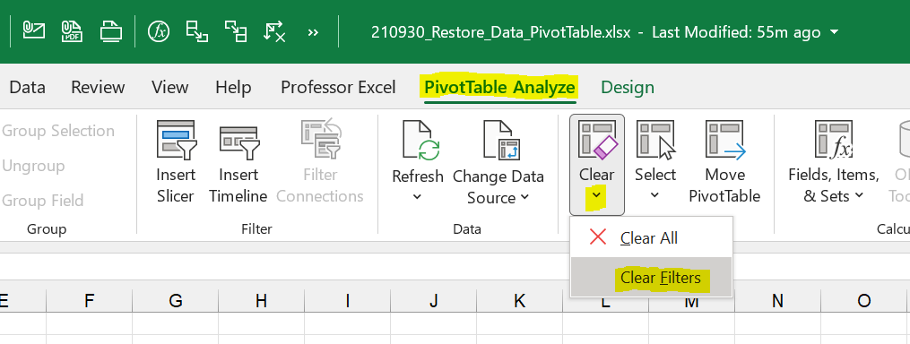

How to Restore All Raw Source Data From PivotTable

<https://professor-excel.com/how-to-restore-all-raw-source-data-from-pivottable/>

Cuando importas un libro de Excel con `read.xlsx` u otras herramientas de lectura de archivos de Excel, se importan los datos almacenados en las celdas de la hoja de Excel. Sin embargo, las tablas dinámicas son objetos más complejos que incluyen cálculos y agregaciones que no están contenidos en las celdas individuales.

Las tablas dinámicas están construidas a partir de una **fuente de datos** y se definen en términos de filas, columnas y valores agregados. Aunque los datos subyacentes pueden estar en una hoja de Excel, la tabla dinámica se construye a partir de esta fuente de datos y no está simplemente leyendo las celdas de la hoja de Excel. Por lo tanto, las herramientas de lectura de archivos de Excel no pueden leer directamente la información contenida en una tabla dinámica.
