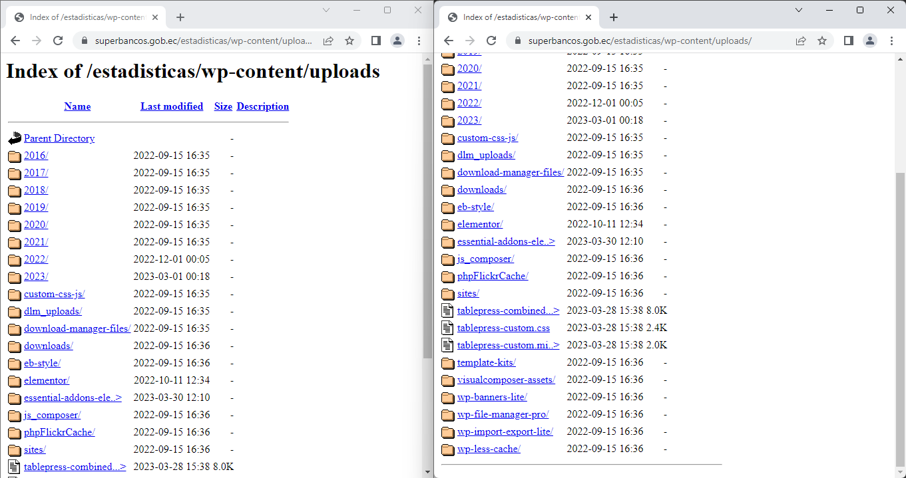
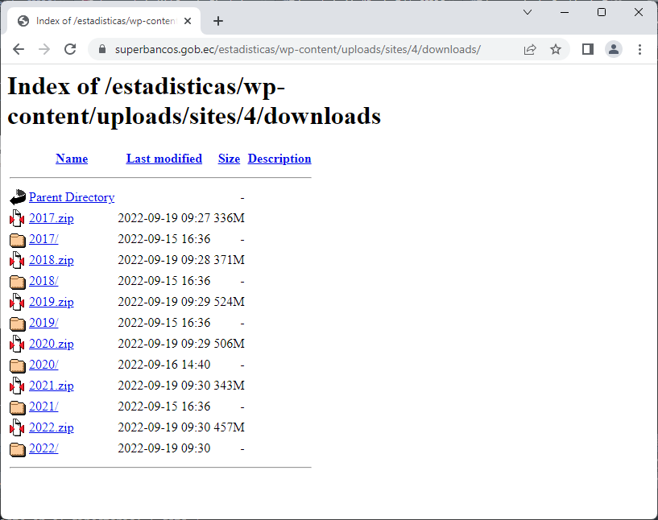

```{r setup, include=FALSE}
knitr::opts_chunk$set(echo = TRUE)
```

# Directorio en línea de la Superintendencia de Bancos

## Hallazgos

### Enlace general

<https://www.superbancos.gob.ec/estadisticas/wp-content/uploads/>



### Enlace de descargas

<https://www.superbancos.gob.ec/estadisticas/wp-content/uploads/sites/4/downloads/>



### Infomración no automatizable

La del año 2023, por que viene de un enlace de onedrive:

#### Ejemplo 2023

<a href="https://www.superbancos.gob.ec/estadisticas/portalestudios/wp-admin/admin-ajax.php?action=shareonedrive-download&amp;id=01ONK3WL7MBSJ5UW24HZAKHTEGPJTY2FND&amp;account_id=341c37a6-daa9-4b83-adad-506b00ccb984&amp;drive_id=b!Iz-mji9B1EqK1eiAuGWU7x82x3m7uftFja_xK_rSLWY6gLR41EOqTYg222Ho8lwD&amp;listtoken=1468a8655b967848c735efcc6d76b02a" class="entry_link entry_action_download" title="BOLETIN BANCOS FEBRERO 2023.zip (737 KB)" data-name="BOLETIN BANCOS FEBRERO 2023.zip" data-entry-id="01ONK3WL7MBSJ5UW24HZAKHTEGPJTY2FND">BOLETIN BANCOS FEBRERO 2023.zip</a>

## Limitaciones

R es un lenguaje de programación utilizado principalmente para análisis estadístico y gráficos. No está diseñado para interactuar directamente con páginas web y no puede hacer clic en un botón en una página web.

Si deseas automatizar la interacción con una página web, puedes utilizar herramientas como Selenium WebDriver o Puppeteer. Estas herramientas te permiten escribir scripts que pueden interactuar con páginas web de manera automatizada, incluyendo hacer clic en botones y completar formularios.

### Nodo

```{html}
 <div id="ShareoneDrive-1468a8655b967848c735efcc6d76b02a" class="wpcp-module ShareoneDrive files wpcp-list-view" data-list="files" data-token="1468a8655b967848c735efcc6d76b02a" data-account-id="341c37a6-daa9-4b83-adad-506b00ccb984" data-drive-id="b!Iz-mji9B1EqK1eiAuGWU7x82x3m7uftFja_xK_rSLWY6gLR41EOqTYg222Ho8lwD" data-id="01ONK3WL5YZDTIKNK32ND3L2LRIZSC6HJB" data-path="WyIwMU9OSzNXTDVZWkRUSUtOSzMyTkQzTDJMUklaU0M2SEpCIl0=" data-sort="modified:desc" data-org-id="" data-org-path="bnVsbA==" data-source="0bcf35a99acf696c49c5bb35e1a61aa4" data-layout="list" data-lightboxnav="1" data-lightboxthumbs="1" data-query="" data-action="0" style="width: 100%;">
```

**`data-token`** es un atributo personalizado en HTML que se utiliza para almacenar datos personalizados en una página o aplicación. Los atributos **`data-*`** nos permiten incrustar atributos de datos personalizados en todos los elementos HTML. [Los datos almacenados pueden ser utilizados por el JavaScript de la página para crear una experiencia de usuario más atractiva sin necesidad de realizar llamadas Ajax o consultas a bases de datos del lado del servidor^**1**^](https://www.w3schools.com/TAGS/att_data-.asp).

Un ejemplo común del uso de **`data-token`** es para prevenir ataques CSRF (Cross-Site Request Forgery) en formularios HTML. [Un token único se genera y se almacena en el atributo **`data-token`** de un elemento del formulario, y luego se verifica en el lado del servidor para asegurarse de que la solicitud proviene de una fuente confiable^**2**^](https://stackoverflow.com/questions/8191303/reason-for-using-a-token-in-html-form-and-checking-in-php-code).
