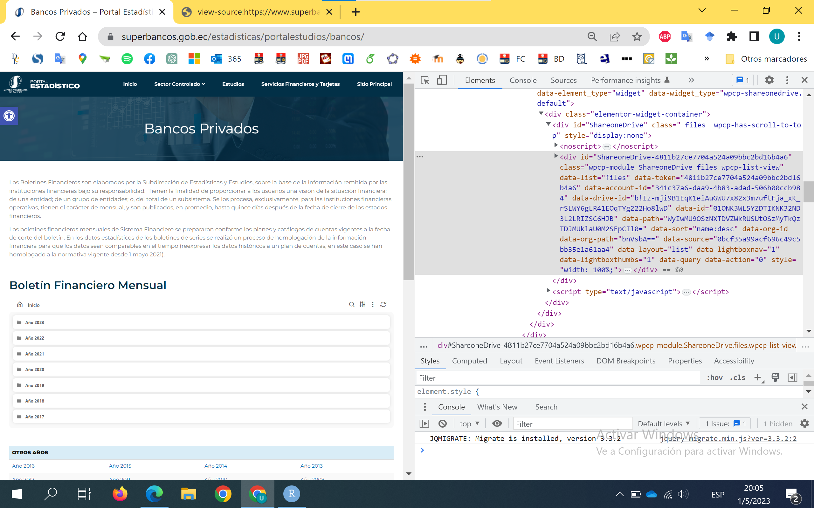
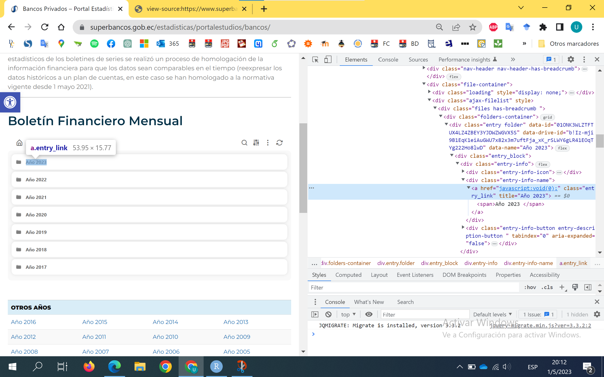
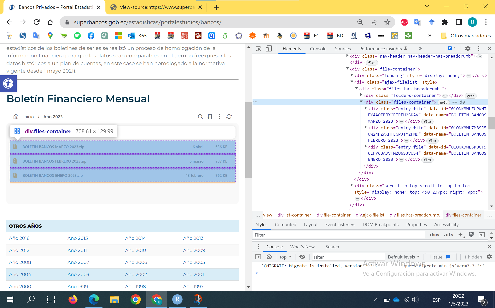

```{r setup, include=FALSE}
knitr::opts_chunk$set(echo = TRUE)
```

# Caso: Boletín Financiero Mensual

## Identificación del contenedor de descargas

Empleando el Inspector de código que incorpora Google Chrome identificamos rápidamente el código correspondiente al contenedor de archivos que se desea "raspar":

```{html}
<div class="elementor-element elementor-element-3c1c97b elementor-widget elementor-widget-wpcp-shareonedrive" data-id="3c1c97b" data-element_type="widget" data-widget_type="wpcp-shareonedrive.default">
                <div class="elementor-widget-container">
            <div id="ShareoneDrive" class=" files  wpcp-has-scroll-to-top" style="display:none"><noscript><div class='ShareoneDrive-nojsmessage'>Para ver este contenido, necesita tener activado JavaScript en su navegador.<br/><a href='http://www.enable-javascript.com/' target='_blank'>Para hacerlo, siga las siguientes instrucciones</a>.</div></noscript><div id="ShareoneDrive-4811b27ce7704a524a09bbc2bd16b4a6" class="wpcp-module ShareoneDrive files wpcp-list-view" data-list="files" data-token="4811b27ce7704a524a09bbc2bd16b4a6" data-account-id="341c37a6-daa9-4b83-adad-506b00ccb984" data-drive-id="b!Iz-mji9B1EqK1eiAuGWU7x82x3m7uftFja_xK_rSLWY6gLR41EOqTYg222Ho8lwD" data-id="01ONK3WL5YZDTIKNK32ND3L2LRIZSC6HJB" data-path="WyIwMU9OSzNXTDVZWkRUSUtOSzMyTkQzTDJMUklaU0M2SEpCIl0=" data-sort="name:desc" data-org-id="" data-org-path="bnVsbA==" data-source="0bcf35a99acf696c49c5bb35e1a61aa4" data-layout="list" data-lightboxnav="1" data-lightboxthumbs="1" data-query="" data-action="0" style="width: 100%;"><div class="list-container" style="width:100%;max-width:100%;">    <div class="nav-header nav-header-has-breadcrumb">        <a class="nav-home entry-info-button" title="Vuelva a la carpeta de inicio" tabindex="0">
            <i class="eva eva-home-outline"></i>
        </a>
        <div class="nav-title"><ol class="wpcp-breadcrumb wpcp wpcp-left"><li class="dropdown wpcp-dropdown is-hidden" style="">
      <a href="javascript:void(0);" class="wpcp-toggle" data-toggle="dropdown">
        <i class="eva eva-arrow-down"></i>
      </a>
      <ul class="dropdown-menu tippy-content"><li class="is-hidden"><a href="#01ONK3WL5YZDTIKNK32ND3L2LRIZSC6HJB"><i class="eva eva-folder eva-lg"></i>  Inicio</a></li></ul>
    </li><li class="wpcp-ellipsis is-hidden" style="">…</li><li class="first-breadcrumb"><a href="#01ONK3WL5YZDTIKNK32ND3L2LRIZSC6HJB" class="folder current_folder" data-id="01ONK3WL5YZDTIKNK32ND3L2LRIZSC6HJB" data-drive-id="b!Iz-mji9B1EqK1eiAuGWU7x82x3m7uftFja_xK_rSLWY6gLR41EOqTYg222Ho8lwD">Inicio</a></li></ol></div>
                <a class="nav-search entry-info-button" tabindex="0" aria-expanded="false">
            <i class="eva eva-search"></i>
        </a>

        
        

        <a class="nav-sort entry-info-button" title="Opciones de orden" aria-expanded="false">
            <i class="eva eva-options"></i>
        </a>
        

        <a class="nav-gear entry-info-button" title="Más acciones" aria-expanded="false">
            <i class="eva eva-more-vertical-outline"></i>
        </a>
        
                        <a class="nav-refresh entry-info-button" title="Actualizar">
                    <i class="eva eva-sync"></i>
                </a>
                </div>    <div class="file-container">
        <div class="loading" style="display: none;">            <svg class="loader-spinner" viewBox="25 25 50 50">
                <circle class="path" cx="50" cy="50" r="20" fill="none" stroke-width="3" stroke-miterlimit="10"></circle>
            </svg>
                    </div>
        <div class="ajax-filelist" style=""><div class="files has-breadcrumb "><div class="folders-container"><div class="entry folder" data-id="01ONK3WLZTFTUX4LZ4ZBEY3YJDWZWGVX5S" data-drive-id="b!Iz-mji9B1EqK1eiAuGWU7x82x3m7uftFja_xK_rSLWY6gLR41EOqTYg222Ho8lwD" data-name="Año 2023">
<div class="entry_block">
<div class="entry-info"><div class="entry-info-icon"></div><div class="entry-info-name"><a href="javascript:void(0);" class="entry_link" title="Año 2023"><span>Año 2023 </span></a></div><div class="entry-info-button entry-description-button " tabindex="0" aria-expanded="false"><i class="eva eva-info-outline eva-lg"></i>
<div class="tippy-content-holder"><div class="description-textbox"><div class="description-file-name">Año 2023</div><div class="description-file-info"><i class="eva eva-clock-outline"></i> 14 febrero, 2023 9:48 am • 2 MB</div></div></div></div></div>
</div>
</div>
<div class="entry folder" data-id="01ONK3WLY7WPUKDMR4AJCKJFNUDUIB3UXG" data-drive-id="b!Iz-mji9B1EqK1eiAuGWU7x82x3m7uftFja_xK_rSLWY6gLR41EOqTYg222Ho8lwD" data-name="Año 2022">
<div class="entry_block">
<div class="entry-info"><div class="entry-info-icon"></div><div class="entry-info-name"><a href="javascript:void(0);" class="entry_link" title="Año 2022"><span>Año 2022 </span></a></div><div class="entry-info-button entry-description-button " tabindex="0" aria-expanded="false"><i class="eva eva-info-outline eva-lg"></i>
<div class="tippy-content-holder"><div class="description-textbox"><div class="description-file-name">Año 2022</div><div class="description-file-info"><i class="eva eva-clock-outline"></i> 12 diciembre, 2022 4:55 pm • 8 MB</div></div></div></div></div>
</div>
</div>
<div class="entry folder" data-id="01ONK3WL7YZ6JTTZVXNFE2YNQ6NNUXUKQQ" data-drive-id="b!Iz-mji9B1EqK1eiAuGWU7x82x3m7uftFja_xK_rSLWY6gLR41EOqTYg222Ho8lwD" data-name="Año 2021">
<div class="entry_block">
<div class="entry-info"><div class="entry-info-icon"></div><div class="entry-info-name"><a href="javascript:void(0);" class="entry_link" title="Año 2021"><span>Año 2021 </span></a></div><div class="entry-info-button entry-description-button " tabindex="0" aria-expanded="false"><i class="eva eva-info-outline eva-lg"></i>
<div class="tippy-content-holder"><div class="description-textbox"><div class="description-file-name">Año 2021</div><div class="description-file-info"><i class="eva eva-clock-outline"></i> 29 septiembre, 2022 4:01 pm • 13 MB</div></div></div></div></div>
</div>
</div>
<div class="entry folder" data-id="01ONK3WL3Z7K26CYSM6JC2YKVXY2EREYBG" data-drive-id="b!Iz-mji9B1EqK1eiAuGWU7x82x3m7uftFja_xK_rSLWY6gLR41EOqTYg222Ho8lwD" data-name="Año 2020">
<div class="entry_block">
<div class="entry-info"><div class="entry-info-icon"></div><div class="entry-info-name"><a href="javascript:void(0);" class="entry_link" title="Año 2020"><span>Año 2020 </span></a></div><div class="entry-info-button entry-description-button " tabindex="0" aria-expanded="false"><i class="eva eva-info-outline eva-lg"></i>
<div class="tippy-content-holder"><div class="description-textbox"><div class="description-file-name">Año 2020</div><div class="description-file-info"><i class="eva eva-clock-outline"></i> 20 septiembre, 2022 8:35 pm • 16 MB</div></div></div></div></div>
</div>
</div>
<div class="entry   folder " data-id="01ONK3WLZVOMAOMXU535AYNT5GPIRCYRWM" data-drive-id="b!Iz-mji9B1EqK1eiAuGWU7x82x3m7uftFja_xK_rSLWY6gLR41EOqTYg222Ho8lwD" data-name="Año 2019">
<div class="entry_block">
<div class="entry-info"><div class="entry-info-icon"></div><div class="entry-info-name"><a href="javascript:void(0);" class="entry_link" title="Año 2019"><span>Año 2019 </span></a></div><div class="entry-info-button entry-description-button " tabindex="0" aria-expanded="false"><i class="eva eva-info-outline eva-lg"></i>
<div class="tippy-content-holder"><div class="description-textbox"><div class="description-file-name">Año 2019</div><div class="description-file-info"><i class="eva eva-clock-outline"></i> 30 agosto, 2022 4:36 pm • 14 MB</div></div></div></div></div>
</div>
</div>
<div class="entry   folder " data-id="01ONK3WL46YXOHX6G6LNALFZ3YMUDZBJB2" data-drive-id="b!Iz-mji9B1EqK1eiAuGWU7x82x3m7uftFja_xK_rSLWY6gLR41EOqTYg222Ho8lwD" data-name="Año 2018">
<div class="entry_block">
<div class="entry-info"><div class="entry-info-icon"></div><div class="entry-info-name"><a href="javascript:void(0);" class="entry_link" title="Año 2018"><span>Año 2018 </span></a></div><div class="entry-info-button entry-description-button " tabindex="0" aria-expanded="false"><i class="eva eva-info-outline eva-lg"></i>
<div class="tippy-content-holder"><div class="description-textbox"><div class="description-file-name">Año 2018</div><div class="description-file-info"><i class="eva eva-clock-outline"></i> 30 agosto, 2022 4:57 pm • 14 MB</div></div></div></div></div>
</div>
</div>
<div class="entry   folder " data-id="01ONK3WL47BDVYGX47KZAKKGAEMN2UUE65" data-drive-id="b!Iz-mji9B1EqK1eiAuGWU7x82x3m7uftFja_xK_rSLWY6gLR41EOqTYg222Ho8lwD" data-name="Año 2017">
<div class="entry_block">
<div class="entry-info"><div class="entry-info-icon"></div><div class="entry-info-name"><a href="javascript:void(0);" class="entry_link" title="Año 2017"><span>Año 2017 </span></a></div><div class="entry-info-button entry-description-button " tabindex="0" aria-expanded="false"><i class="eva eva-info-outline eva-lg"></i>
<div class="tippy-content-holder"><div class="description-textbox"><div class="description-file-name">Año 2017</div><div class="description-file-info"><i class="eva eva-clock-outline"></i> 30 agosto, 2022 4:57 pm • 14 MB</div></div></div></div></div>
</div>
</div>
</div><div class="files-container"></div></div></div>
        <div class="scroll-to-top scroll-to-top-bottom" style="display: none; top: 450.237px; right: 0px;">
            <button class="scroll-to-top-action button button-round-icon secondary button-round-icon-lg button-shadow-3" type="button" title="Ir arriba" aria-expanded="false" style="display: none;"><i class="eva eva-arrow-upward-outline eva-2x"></i></button>            
                    </div>
    </div>
</div></div></div><script type="text/javascript">if (typeof(jQuery) !== 'undefined' && typeof(jQuery.cp) !== 'undefined' && typeof(jQuery.cp.ShareoneDrive) === 'function') { jQuery('#ShareoneDrive-4811b27ce7704a524a09bbc2bd16b4a6').ShareoneDrive(ShareoneDrive_vars); };</script>      </div>
                </div>
```



El identificador del contenedor `div` refleja el módulo `ShareoneDrive`.

Expandiendo los contenedores se llega al nodo `a href` donde esperaríamos encontrar los enlaces de descarga, pero se encuentra un método que no permite obtener directamente los enlaces deseados, y que depende de la interacción con los botones del contenedor de archivos; por ejemplo al botón `Año 2023` corresponde el código:

```{html}
<a href="javascript:void(0);" class="entry_link" title="Año 2023"><span>Año 2023 </span></a>
```



El código con los enlaces solo se revela una vez pulsado el botón `Año 2023`:

```{html}
<div class="files-container"><div class="entry file" data-id="01ONK3WLZUPWHTEY4AOFBJXCRTRFH2SKAV" data-name="BOLETIN BANCOS MARZO 2023">
<div class="entry_block">
<div class="entry_thumbnail"><div class="entry_thumbnail-view-bottom"><div class="entry_thumbnail-view-center">
<div class="preloading"></div></div></div></div>
<div class="entry-info"><div class="entry-info-icon "></div><div class="entry-info-name"><a href="https://www.superbancos.gob.ec/estadisticas/portalestudios/wp-admin/admin-ajax.php?action=shareonedrive-download&amp;id=01ONK3WLZUPWHTEY4AOFBJXCRTRFH2SKAV&amp;account_id=341c37a6-daa9-4b83-adad-506b00ccb984&amp;drive_id=b!Iz-mji9B1EqK1eiAuGWU7x82x3m7uftFja_xK_rSLWY6gLR41EOqTYg222Ho8lwD&amp;listtoken=4811b27ce7704a524a09bbc2bd16b4a6" class="entry_link entry_action_download" title="BOLETIN BANCOS MARZO 2023.zip (636 KB)" data-name="BOLETIN BANCOS MARZO 2023.zip" data-entry-id="01ONK3WLZUPWHTEY4AOFBJXCRTRFH2SKAV"><span>BOLETIN BANCOS MARZO 2023.zip</span></a></div><div class="entry-info-modified-date entry-info-metadata">6 abril</div><div class="entry-info-size entry-info-metadata">636 KB</div><div class="entry-info-button entry-download-button" tabindex="0">
            <a class="entry_action_download" href="https://www.superbancos.gob.ec/estadisticas/portalestudios/wp-admin/admin-ajax.php?action=shareonedrive-download&amp;dl=1&amp;id=01ONK3WLZUPWHTEY4AOFBJXCRTRFH2SKAV&amp;drive_id=b!Iz-mji9B1EqK1eiAuGWU7x82x3m7uftFja_xK_rSLWY6gLR41EOqTYg222Ho8lwD&amp;account_id=341c37a6-daa9-4b83-adad-506b00ccb984&amp;listtoken=4811b27ce7704a524a09bbc2bd16b4a6" download="BOLETIN BANCOS MARZO 2023.zip" data-name="BOLETIN BANCOS MARZO 2023.zip" title="Descargar fichero"><i class="eva eva-download eva-lg"></i></a>
</div><div class="entry-info-button entry-description-button " tabindex="0" aria-expanded="false"><i class="eva eva-info-outline eva-lg"></i>
<div class="tippy-content-holder"><div class="description-textbox"><div class="description-file-name">BOLETIN BANCOS MARZO 2023.zip</div><div class="description-file-info"><i class="eva eva-clock-outline"></i> 6 abril, 2023 5:00 pm • 636 KB</div></div></div></div><div class="entry-info-button entry-action-menu-button" title="Más acciones" tabindex="0" aria-expanded="false"><i class="eva eva-more-vertical-outline"></i><div id="menu-01ONK3WLZUPWHTEY4AOFBJXCRTRFH2SKAV" class="entry-action-menu-button-content tippy-content-holder"><ul data-id="01ONK3WLZUPWHTEY4AOFBJXCRTRFH2SKAV" data-name="BOLETIN BANCOS MARZO 2023"><li><a href="https://www.superbancos.gob.ec/estadisticas/portalestudios/wp-admin/admin-ajax.php?action=shareonedrive-download&amp;id=01ONK3WLZUPWHTEY4AOFBJXCRTRFH2SKAV&amp;dl=1&amp;account_id=341c37a6-daa9-4b83-adad-506b00ccb984&amp;drive_id=b!Iz-mji9B1EqK1eiAuGWU7x82x3m7uftFja_xK_rSLWY6gLR41EOqTYg222Ho8lwD&amp;listtoken=4811b27ce7704a524a09bbc2bd16b4a6" class="entry_action_download" download="BOLETIN BANCOS MARZO 2023.zip" data-name="BOLETIN BANCOS MARZO 2023.zip" title="Descargar fichero"><i class="eva eva-download eva-lg"></i>&nbsp;Descargar fichero</a></li></ul></div></div>
</div>
</div>
</div>
<div class="entry file" data-id="01ONK3WL7MBSJ5UW24HZAKHTEGPJTY2FND" data-name="BOLETIN BANCOS FEBRERO 2023">
<div class="entry_block">
<div class="entry_thumbnail"><div class="entry_thumbnail-view-bottom"><div class="entry_thumbnail-view-center">
<div class="preloading"></div></div></div></div>
<div class="entry-info"><div class="entry-info-icon "></div><div class="entry-info-name"><a href="https://www.superbancos.gob.ec/estadisticas/portalestudios/wp-admin/admin-ajax.php?action=shareonedrive-download&amp;id=01ONK3WL7MBSJ5UW24HZAKHTEGPJTY2FND&amp;account_id=341c37a6-daa9-4b83-adad-506b00ccb984&amp;drive_id=b!Iz-mji9B1EqK1eiAuGWU7x82x3m7uftFja_xK_rSLWY6gLR41EOqTYg222Ho8lwD&amp;listtoken=4811b27ce7704a524a09bbc2bd16b4a6" class="entry_link entry_action_download" title="BOLETIN BANCOS FEBRERO 2023.zip (737 KB)" data-name="BOLETIN BANCOS FEBRERO 2023.zip" data-entry-id="01ONK3WL7MBSJ5UW24HZAKHTEGPJTY2FND"><span>BOLETIN BANCOS FEBRERO 2023.zip</span></a></div><div class="entry-info-modified-date entry-info-metadata">6 marzo</div><div class="entry-info-size entry-info-metadata">737 KB</div><div class="entry-info-button entry-download-button" tabindex="0">
            <a class="entry_action_download" href="https://www.superbancos.gob.ec/estadisticas/portalestudios/wp-admin/admin-ajax.php?action=shareonedrive-download&amp;dl=1&amp;id=01ONK3WL7MBSJ5UW24HZAKHTEGPJTY2FND&amp;drive_id=b!Iz-mji9B1EqK1eiAuGWU7x82x3m7uftFja_xK_rSLWY6gLR41EOqTYg222Ho8lwD&amp;account_id=341c37a6-daa9-4b83-adad-506b00ccb984&amp;listtoken=4811b27ce7704a524a09bbc2bd16b4a6" download="BOLETIN BANCOS FEBRERO 2023.zip" data-name="BOLETIN BANCOS FEBRERO 2023.zip" title="Descargar fichero"><i class="eva eva-download eva-lg"></i></a>
</div><div class="entry-info-button entry-description-button " tabindex="0" aria-expanded="false"><i class="eva eva-info-outline eva-lg"></i>
<div class="tippy-content-holder"><div class="description-textbox"><div class="description-file-name">BOLETIN BANCOS FEBRERO 2023.zip</div><div class="description-file-info"><i class="eva eva-clock-outline"></i> 6 marzo, 2023 5:45 pm • 737 KB</div></div></div></div><div class="entry-info-button entry-action-menu-button" title="Más acciones" tabindex="0" aria-expanded="false"><i class="eva eva-more-vertical-outline"></i><div id="menu-01ONK3WL7MBSJ5UW24HZAKHTEGPJTY2FND" class="entry-action-menu-button-content tippy-content-holder"><ul data-id="01ONK3WL7MBSJ5UW24HZAKHTEGPJTY2FND" data-name="BOLETIN BANCOS FEBRERO 2023"><li><a href="https://www.superbancos.gob.ec/estadisticas/portalestudios/wp-admin/admin-ajax.php?action=shareonedrive-download&amp;id=01ONK3WL7MBSJ5UW24HZAKHTEGPJTY2FND&amp;dl=1&amp;account_id=341c37a6-daa9-4b83-adad-506b00ccb984&amp;drive_id=b!Iz-mji9B1EqK1eiAuGWU7x82x3m7uftFja_xK_rSLWY6gLR41EOqTYg222Ho8lwD&amp;listtoken=4811b27ce7704a524a09bbc2bd16b4a6" class="entry_action_download" download="BOLETIN BANCOS FEBRERO 2023.zip" data-name="BOLETIN BANCOS FEBRERO 2023.zip" title="Descargar fichero"><i class="eva eva-download eva-lg"></i>&nbsp;Descargar fichero</a></li></ul></div></div>
</div>
</div>
</div>
<div class="entry file" data-id="01ONK3WL5KUGT56EHY6BAJVTMZU6SJVUS4" data-name="BOLETIN BANCOS ENERO 2023">
<div class="entry_block">
<div class="entry_thumbnail"><div class="entry_thumbnail-view-bottom"><div class="entry_thumbnail-view-center">
<div class="preloading"></div></div></div></div>
<div class="entry-info"><div class="entry-info-icon "></div><div class="entry-info-name"><a href="https://www.superbancos.gob.ec/estadisticas/portalestudios/wp-admin/admin-ajax.php?action=shareonedrive-download&amp;id=01ONK3WL5KUGT56EHY6BAJVTMZU6SJVUS4&amp;account_id=341c37a6-daa9-4b83-adad-506b00ccb984&amp;drive_id=b!Iz-mji9B1EqK1eiAuGWU7x82x3m7uftFja_xK_rSLWY6gLR41EOqTYg222Ho8lwD&amp;listtoken=4811b27ce7704a524a09bbc2bd16b4a6" class="entry_link entry_action_download" title="BOLETIN BANCOS ENERO 2023.zip (762 KB)" data-name="BOLETIN BANCOS ENERO 2023.zip" data-entry-id="01ONK3WL5KUGT56EHY6BAJVTMZU6SJVUS4"><span>BOLETIN BANCOS ENERO 2023.zip</span></a></div><div class="entry-info-modified-date entry-info-metadata">13 febrero</div><div class="entry-info-size entry-info-metadata">762 KB</div><div class="entry-info-button entry-download-button" tabindex="0">
            <a class="entry_action_download" href="https://www.superbancos.gob.ec/estadisticas/portalestudios/wp-admin/admin-ajax.php?action=shareonedrive-download&amp;dl=1&amp;id=01ONK3WL5KUGT56EHY6BAJVTMZU6SJVUS4&amp;drive_id=b!Iz-mji9B1EqK1eiAuGWU7x82x3m7uftFja_xK_rSLWY6gLR41EOqTYg222Ho8lwD&amp;account_id=341c37a6-daa9-4b83-adad-506b00ccb984&amp;listtoken=4811b27ce7704a524a09bbc2bd16b4a6" download="BOLETIN BANCOS ENERO 2023.zip" data-name="BOLETIN BANCOS ENERO 2023.zip" title="Descargar fichero"><i class="eva eva-download eva-lg"></i></a>
</div><div class="entry-info-button entry-description-button " tabindex="0" aria-expanded="false"><i class="eva eva-info-outline eva-lg"></i>
<div class="tippy-content-holder"><div class="description-textbox"><div class="description-file-name">BOLETIN BANCOS ENERO 2023.zip</div><div class="description-file-info"><i class="eva eva-clock-outline"></i> 13 febrero, 2023 6:14 pm • 762 KB</div></div></div></div><div class="entry-info-button entry-action-menu-button" title="Más acciones" tabindex="0" aria-expanded="false"><i class="eva eva-more-vertical-outline"></i><div id="menu-01ONK3WL5KUGT56EHY6BAJVTMZU6SJVUS4" class="entry-action-menu-button-content tippy-content-holder"><ul data-id="01ONK3WL5KUGT56EHY6BAJVTMZU6SJVUS4" data-name="BOLETIN BANCOS ENERO 2023"><li><a href="https://www.superbancos.gob.ec/estadisticas/portalestudios/wp-admin/admin-ajax.php?action=shareonedrive-download&amp;id=01ONK3WL5KUGT56EHY6BAJVTMZU6SJVUS4&amp;dl=1&amp;account_id=341c37a6-daa9-4b83-adad-506b00ccb984&amp;drive_id=b!Iz-mji9B1EqK1eiAuGWU7x82x3m7uftFja_xK_rSLWY6gLR41EOqTYg222Ho8lwD&amp;listtoken=4811b27ce7704a524a09bbc2bd16b4a6" class="entry_action_download" download="BOLETIN BANCOS ENERO 2023.zip" data-name="BOLETIN BANCOS ENERO 2023.zip" title="Descargar fichero"><i class="eva eva-download eva-lg"></i>&nbsp;Descargar fichero</a></li></ul></div></div>
</div>
</div>
</div>
</div>
```



## Limitaciones con el paquete `Rvest`

Si los enlaces solo aparecen después de hacer clic en un botón, es posible que la página esté utilizando JavaScript para cargar contenido dinámicamente. En este caso, **`rvest`** no puede manejar directamente el contenido generado por JavaScript. Una solución podría ser utilizar un navegador automatizado como RSelenium o PhantomJS para interactuar con la página y hacer clic en el botón antes de extraer el contenido.

# Prueba de uso de `RSelenium` con `PhantomJS`

## Instalación de `PhantomJS`

PhantomJS está disponible en R. Puedes instalarlo utilizando la función **`install_phantomjs()`** del paquete **`webshot`**. [Simplemente ejecuta el siguiente comando en la consola de R:^1^](https://stackoverflow.com/questions/62681262/how-to-install-phantomjs-in-r-studio).

```{r}
webshot::install_phantomjs()
```

Esto descargará e instalará PhantomJS en tu directorio de librerías predeterminado.

## Empleo de `RSelenium` con `PhantomJS`

PhantomJS puede interactuar con elementos de una página que utilizan JavaScript. En este caso, puedes usar PhantomJS para hacer clic en el enlace con el atributo **`href="javascript:void(0);"`** y la clase **`entry_link`**. Una vez que se hace clic en el enlace, PhantomJS puede esperar a que el contenido generado por JavaScript se cargue y luego extraer la información deseada.

Para hacer esto, puedes usar un paquete como **`RSelenium`** para controlar PhantomJS desde R. Con **`RSelenium`**, puedes iniciar una sesión de PhantomJS, navegar a la página deseada y utilizar comandos como **`clickElement()`** para interactuar con los elementos de la página.

## Ejemplo

Aquí hay un ejemplo de cómo podrías usar `RSelenium` con PhantomJS para hacer clic en un enlace con el atributo `href="javascript:void(0);"` y la clase `entry_link`:

```{r}
# Carga las librerías necesarias
library(RSelenium)
library(rvest)

# Inicia una sesión de PhantomJS
rD <- rsDriver(browser = "phantomjs")
rD <- rsDriver(browser = "phantomjs", port = as.integer(1234))
remDr <- rD$client

# Navega a la página deseada
url <- "https://www.superbancos.gob.ec/estadisticas/portalestudios/bancos/"
remDr$navigate(url)

# Encuentra el enlace y haz clic en él
link <- remDr$findElement(using = "css selector", ".entry_link")
link$clickElement()

# Espera a que el contenido generado por JavaScript se cargue
Sys.sleep(5)

# Extrae el contenido de la página
page_source <- remDr$getPageSource()[[1]]
page_content <- read_html(page_source)

# Cierra la sesión de PhantomJS
remDr$close()
rD$server$stop()
```

Este código inicia una sesión de PhantomJS utilizando `RSelenium`, navega a la página deseada y encuentra el enlace con el atributo `href="javascript:void(0);"` y la clase `entry_link`. Luego hace clic en el enlace y espera a que el contenido generado por JavaScript se cargue. Finalmente, extrae el contenido de la página y lo convierte en un objeto `xml_document` utilizando `read_html()` del paquete `rvest`.

A partir de aquí, puedes utilizar las funciones de `rvest` para extraer la información deseada del objeto `page_content`.

Espero que este ejemplo te ayude a empezar. ¿Hay algo más en lo que pueda ayudarte?

### Problemas con `Rselenium`

Parece que estás teniendo problemas para iniciar una sesión de PhantomJS con `RSelenium`. El mensaje de error indica que no se pudo conectar al servidor local en el puerto 4567.

Hay algunas cosas que puedes intentar para solucionar este problema:

1.  Asegúrate de que tienes la última versión de `RSelenium` y `wdman` instaladas. Puedes actualizar los paquetes utilizando `install.packages("RSelenium")` y `install.packages("wdman")`.

2.  Verifica que no haya ningún otro proceso utilizando el puerto 4567. Puedes hacer esto ejecutando el comando `netstat -ano | findstr :4567` en la línea de comandos (en Windows) o `lsof -i :4567` en la terminal (en macOS o Linux).

3.  Intenta utilizar un puerto diferente para iniciar el servidor Selenium. Puedes hacer esto especificando el argumento `port` al llamar a `rsDriver()`, por ejemplo: `rD <- rsDriver(browser = "phantomjs", port = 1234)`.

Espero que estas sugerencias te ayuden a solucionar el problema. ¿Hay algo más en lo que pueda ayudarte?

# OTRA

Claro, aquí hay un ejemplo de cómo podrías usar `puppeteer` para hacer clic en un enlace con el atributo `href="javascript:void(0);"` y la clase `entry_link` en la página que mencionaste anteriormente:

```{r}
# Carga las librerías necesarias
library(puppeteerR)

# Inicia una sesión de puppeteer
pup <- pptr$new()

# Navega a la página deseada
url <- "https://www.superbancos.gob.ec/estadisticas/portalestudios/bancos/"
pup$goto(url)

# Encuentra el enlace y haz clic en él
link <- pup$querySelector(".entry_link")
link$click()

# Espera a que el contenido generado por JavaScript se cargue
pup$waitFor(5000)

# Extrae el contenido de la página
page_content <- pup$content()

# Cierra la sesión de puppeteer
pup$close()
```

Este código inicia una sesión de `puppeteer` utilizando `puppeteerR`, navega a la página deseada y encuentra el enlace con el atributo `href="javascript:void(0);"` y la clase `entry_link`. Luego hace clic en el enlace y espera a que el contenido generado por JavaScript se cargue. Finalmente, extrae el contenido de la página como una cadena de texto.

A partir de aquí, puedes utilizar las funciones de `rvest` para convertir el contenido de la página en un objeto `xml_document` y extraer la información deseada. Por ejemplo:

```{r}
library(rvest)

page_content_xml <- read_html(page_content)
```

Espero que este ejemplo te ayude a empezar. ¿Hay algo más en lo que pueda ayudarte?